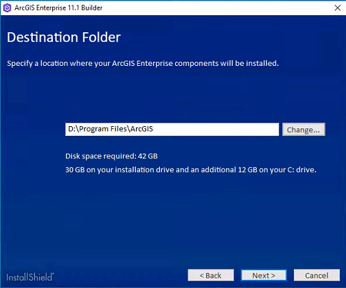

## Install with Enterprise Builder

### Prerequistites
 - Licensing files obtained from My Esri
   - Server license file in ecp/prvc format
   - Portal licence file in json format
 - Domain certificate
   - A certificate signed by the hope.loc domain CA was issued
 - Account to run services
   - A Group Managed Service Account (gMSA) was created by Hope 
   - User: hopegas\Esri_Dev$

### Install ArcGIS Enterprise Builder

 1. Run the builder.exe program
 2. Accept the master license agreement
 3. Provide the installation location for ArcGIS Enterprise Builder. 

 
 
 4. Specify the account name and password for the service account. 
    1. The Enterprise Builder will not accept a gMSA account.  
    A temporary account was used and then was swicthed to the gMSA afterwards  
 
.png)
 
 5. The Enterprise Builder setup will create an ArcGIS Web Adaptor (IIS) for your hosting server and ArcGIS Enterprise portal. 
 
 .png)

 6. Authroize server the software for use 

 .png)

 7. Authorize portal the software for use

 8. To complete the installation, follow the directions on the screen. 
 After the installation completes, a status dialog box is displayed. 
 Successfully installed components are indicated with a check mark. If a component did not successfully install, 
 see the ArcGISEntBuilder.log file located in ProgramData\ArcGISBuilder11 for more information.

  .png)
  .png)
  .png)

 9. After the installation completes, the post-configuration wizard automatically starts

 ### Configuration After Installation

 Once ArcGIS Enterprise Builder completes the installation of the software, 
 a browser opens and presents the ArcGIS Enterprise configuration wizard.