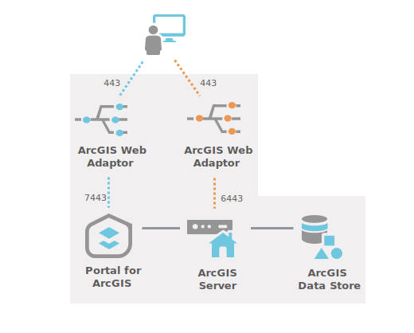

# Dev Enterprise Architecture

The Dev Environment is setup as a single machine deployment.  The system was built using the esri Enterprise Builder installation
method.

 * Machine Name: wsvEsriSd100.hopegas.loc
 * IP: 10.0.3.54
 * DNS:  esriwebdev.hopegas.loc

## System Diagram

 - 

## Installation
ArcGIS Enterprise Builder is an installation and configuration wizard that sets up a base ArcGIS Enterprise deployment 
on a single machine. ArcGIS Enterprise Builder works in two parts:

 1. It installs ArcGIS Enterprise software on your machine.
 2. Next, it opens a browser window to configure the software. Once complete, you can access both your ArcGIS Enterprise portal and ArcGIS Server Manager.

## High Level Steps

 * Install IIS Role on Server
 * Install ArcGIS Enterprise using Enterprise Builder
 * Install HANA Client
   * Connect to HANA from ArcGIS
   * Privileges for geodatabases in SAP HANA
 * Install ArcGIS Pro - Optional 

## System Specifications

### wsvEsriPortq100.hopegas.loc

This is the primary Portal for ArcGIS machine, it is also the location used 
as the primary IIS Web Server and primary Web Adapter for both portal and server.

#### Hardware 
  - 8 Core
  - 32 GB RAM
   
	
#### Apps and Features
 - IIS
 - Portal for ArcGIS - Version: 11.1
 - Web Styles - Version: 11.1
 - Web Adapter (portal) - Version: 11.1
 - Web Adapter (server) - Version 11.1
 - Patches: 
   - ArcGIS-111-WAI-R-Patch
   - ArcGIS-111-PFA-ESSEC-PatchB
 

### wsvEsriPortq200.hopegas.loc

This is the standby Portal for ArcGIS machine, it is also the location used 
as the failover IIS Web Server and failover Web Adapter for both portal and server is installed

#### Hardware 
  - 8 Core
  - 32 GB RAM
   
	
#### Apps and Features
 - IIS
 - Portal for ArcGIS - Version: 11.1
 - Web Styles - Version: 11.1
 - Web Adapter (portal) - Version: 11.1
 - Web Adapter (server) - Version 11.1
 - Patches: 
   - ArcGIS-111-WAI-R-Patch
   - ArcGIS-111-PFA-ESSEC-PatchB

### wsvEsriFedq100.hopegas.loc

This is one of the ArcGIS Server machines used in the 2 server ArcGIS Server deployment.  HANA Client is also 
required on the ArcGIS Server machines

#### Hardware 
  - 8 Core
  - 32 GB RAM

#### Apps and Features
 - ArcGIS Server - Version: 11.1
 - SAP HANA Client
 - Patches 

### wsvEsriFedq200.hopegas.loc

This is one of the ArcGIS Server machines used in the 2 server ArcGIS Server deployment.  HANA Client is also 
required on the ArcGIS Server machines

#### Hardware 
  - 8 Core
  - 32 GB RAM
 
#### Apps and Features
 - ArcGIS Server - Version: 11.1
 - SAP HANA Client
 - Patches 

