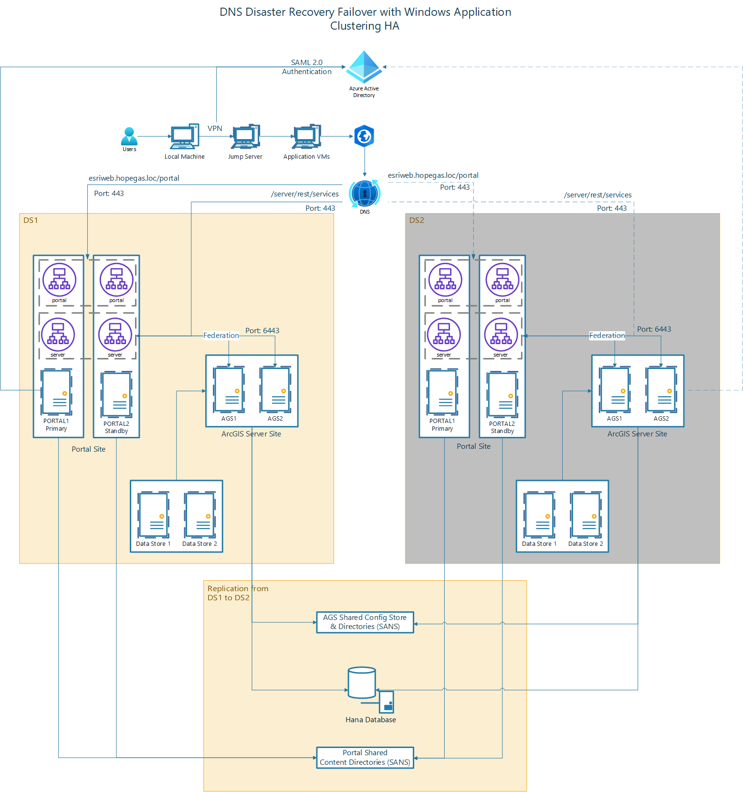

# QA Enterprise Architecture

The QA Environment is setup as a High Availability (HA) multi-machine deployment.  
The setup includes a primary/standby Portal for ArcGIS configuration and a two ArcGIS Server site.  Windows fail-over clustering is used for system fail over.

The following machines are included in the QA deployment:
 - Machine 1: ArcGIS Enterprise primary machine (wsvEsriPortq100.hopegas.loc)
   - Web Adapter (portal) primary
   - Web Adapter (server) primary
 - Machine 2: ArcGIS Enterprise standby machine (wsvEsriPortq200.hopegas.loc)
   - Web Adapter (portal) failover
   - Web Adapter (server) failover
 - Machine 3: ArcGIS Server Node 1 (wsvEsriFedq100.hopegas.loc)
 - Machine 4: ArcGIS Server Node 2 (wsvEsriFedq200.hopegas.loc)
 - 

## System Diagram

 - 

## System Specifications

### wsvEsriPortq100.hopegas.loc

This is the primary Portal for ArcGIS machine, it is also the location used 
as the primary IIS Web Server and primary Web Adapter for both portal and server.

#### Hardware 
  - 8 Core
  - 32 GB RAM
   
	
#### Apps and Features
 - IIS
 - Portal for ArcGIS - Version: 11.1
 - Web Styles - Version: 11.1
 - Web Adapter (portal) - Version: 11.1
 - Web Adapter (server) - Version 11.1
 - Patches: 
   - ArcGIS-111-WAI-R-Patch
   - ArcGIS-111-PFA-ESSEC-PatchB
 

### wsvEsriPortq200.hopegas.loc

This is the standby Portal for ArcGIS machine, it is also the location used 
as the failover IIS Web Server and failover Web Adapter for both portal and server is installed

#### Hardware 
  - 8 Core
  - 32 GB RAM
   
	
#### Apps and Features
 - IIS
 - Portal for ArcGIS - Version: 11.1
 - Web Styles - Version: 11.1
 - Web Adapter (portal) - Version: 11.1
 - Web Adapter (server) - Version 11.1
 - Patches: 
   - ArcGIS-111-WAI-R-Patch
   - ArcGIS-111-PFA-ESSEC-PatchB

### wsvEsriFedq100.hopegas.loc

This is one of the ArcGIS Server machines used in the 2 server ArcGIS Server deployment.  HANA Client is also 
required on the ArcGIS Server machines

#### Hardware 
  - 8 Core
  - 32 GB RAM

#### Apps and Features
 - ArcGIS Server - Version: 11.1
 - SAP HANA Client
 - Patches 

### wsvEsriFedq200.hopegas.loc

This is one of the ArcGIS Server machines used in the 2 server ArcGIS Server deployment.  HANA Client is also 
required on the ArcGIS Server machines

#### Hardware 
  - 8 Core
  - 32 GB RAM
 
#### Apps and Features
 - ArcGIS Server - Version: 11.1
 - SAP HANA Client
 - Patches 

